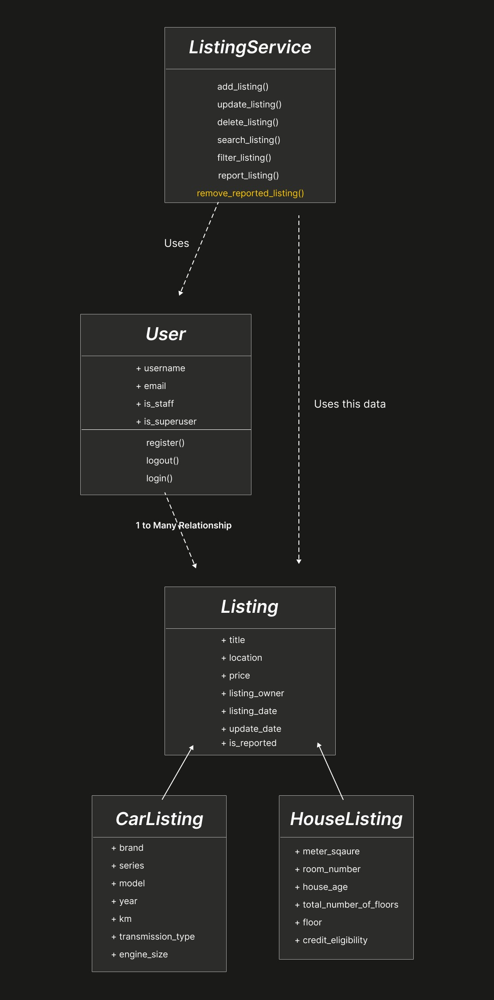

# Sahibinden Mockup

Django ile geliştirilen, ev ve araç ilanlarını yönetildiği bir platform.

## UML Yapısı

## Model Yapısı

### `Listing` (ana model)
Tüm ilan türlerinin ortak taşıdığı alanları içerir. `CarListing` ve `HouseListing` bu modelden inherit olur.

- `title`, `location`, `price`, `listing_date`, `update_date`
- `listing_owner` — ilanı veren kullanıcı (`User`'a foreign key)
- `is_reported` — ilan şikayet edilmiş mi(eğer öyleyse de bunu tek kaldırabilcek yetkili superuser olcak)

### `CarListing(Listing)`
Araç ilanlarına özel alanlar: `brand`, `series`, `model`, `year`, `km`, `transmission_type`, `engine_size` vb.

### `HouseListing(Listing)`
Ev ilanlarına özel alanlar: `meter_square`, `room_number`, `house_age`, `total_number_of_floors`, `floor`, `credit_eligibility`.

**Neden ayrı model yerine inheritance?**
Ev ve araç ilanlarının ortak alanları (fiyat, konum, tarih vb.) tek yerde tutulup kod tekrari önlendi, hem de genel ilan sorgulamaları yapılırken sadece Listing sınıfından yapılabilcek mesela title bazlı vb.

### `User`
Django'nun `AUTH_USER_MODEL`'i kullanılıyor, ayrı bir custom model yok. `is_staff` / `is_superuser` alanları admin yetkisi için Django'nun kendi mekanizmasıyla yönetiliyor — ayrı bir `Admin` modeli yok.

### "Yetkilendirme" pratiği için superuser
`is_reported` bir boolean, eğer bir ilan reported edilirse onu kaldırma yetkisi sadece super_user'da olucak(normalde de superuser'da aslında)

## Asıl işin yapıldığı yer(services.py): `ListingService`

View'ların şişmesini önlemek için ilanlarla ilgili iş mantığı `ListingService` katmanında toplanıyor (view'lar bu fonksiyonları çağırıyor, logic'i kendi içinde barındırmıyor):

- `add_listing()`, `update_listing()`, `delete_listing()` — CRUD işlemleri
- `search_listing()`, `filter_listing()` — arama/filtreleme
- `report_listing()` — kullanıcı bir ilanı şikayet eder
- `remove_reported_listing()` — **admin-only**, şikayet edilen ilanı yetkililer kaldırabilir.

## View Planı

- **Listing listesi / arama sayfası** — tüm ilanları (ev + araç birlikte veya filtrelenmiş) listeler, `search_listing()` / `filter_listing()` kullanır
- **Listing detay sayfası** — tek bir ilanın tüm bilgilerini gösterir(bir ilana tıklayınca gelcek bu sayfa)
- **Listing oluşturma / düzenleme / silme** — giriş yapmış kullanıcı kendi ilanları üzerinde CRUD yapar, `ListingService`'teki ilgili fonksiyonları çağırır
- **Kullanıcı profili** — kullanıcının kendi verdiği ilanları listelediği sayfa
- **Auth sayfaları** — `register()`, `login()`, `logout()`
- **Şikayet işlemi** — ilan detayında "şikayet et" aksiyonu, `report_listing()`'i tetikler
- **Admin paneli / moderasyon** — `is_staff=True` kullanıcılar için şikayet edilen ilanları görüp `remove_reported_listing()` ile kaldırabildiği görünüm

## Mimari Kararlar (özet)

- **Class-based view + custom logic**: kendi get postlarımız yazılcak.
- **Service layer**: asıl logic viewlardan ayrılarak services.py da yazılcak bu sayede viewların içi gereksiz şişmicek
- **Multi-table inheritance**: Ev/araç ilanlarındaki ortak ve özel alanları ayrıştırmak için tercih edildi.
